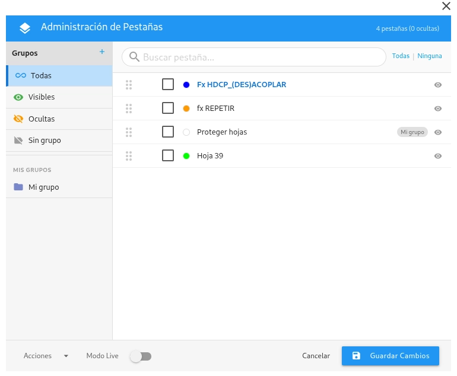
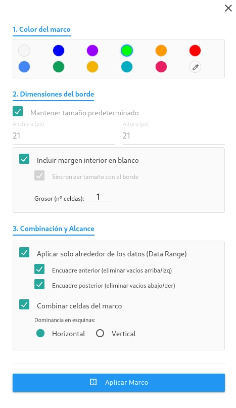
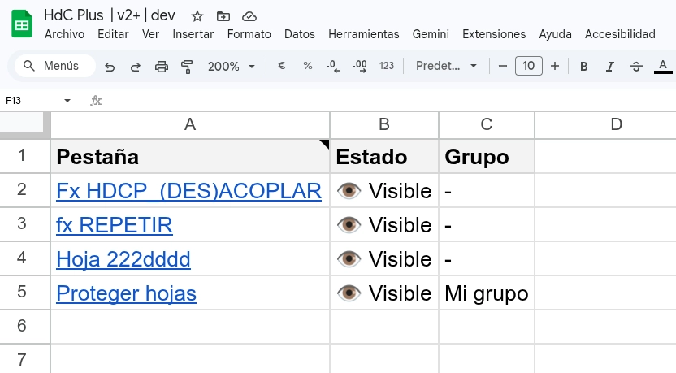
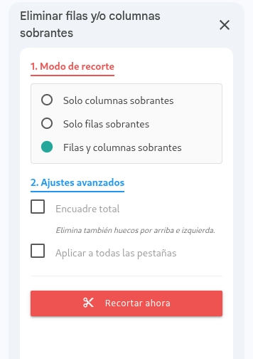
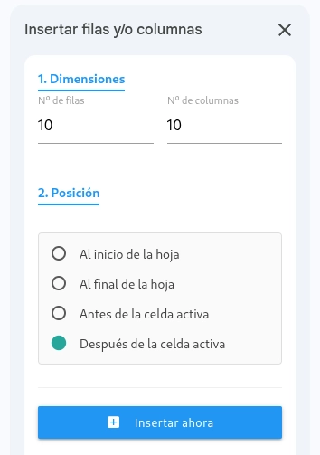
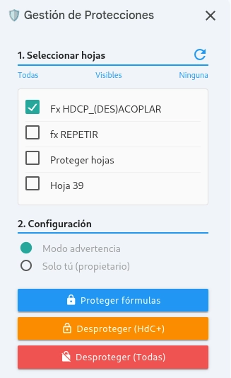

# HdC+

**HdC+** fue originalmente un proyecto personal de aprendizaje y mi segundo complemento tras [Form Response Control (FRC)](https://workspace.google.com/marketplace/app/form_response_control/433492681931). Su primera versión vio la luz a finales de 2019, apenas unos meses antes de mi incorporación al programa de expertos de Google (GDE, Google Developer Expert) en la categoría de Google Workspace. Las circunstancias en las que nació hacen que sea un proyecto al que le tengo enorme cariño. Hoy en día, ha evolucionado hasta convertirse en una potente colección de herramientas y funciones personalizadas para Google Sheets, diseñada para extender las capacidades nativas de tus hojas de cálculo mediante Google Apps Script.

Esta versión 2.0 representa un salto cualitativo en rendimiento, usabilidad y estética, transformando el complemento en una suite profesional de utilidades para el tratamiento de datos y la gestión de documentos complejos.

## 🚀 Novedades de la v2.0
*   **Consola de pestañas avanzada:** Gestiona todas las hojas del documento desde una interfaz centralizada con reordenación drag & drop, creación de grupos y el revolucionario **Modo Live** para sincronización en tiempo real.
    
*   **Marcos de color:** Mejora la estética de tus informes generando bordes coloreados automáticos con control total sobre grosores, márgenes y combinaciones de celdas.
    
*   **Generador de índices dual:** Crea pestañas de índice enriquecidas o inserta listas de navegación ligeras con un solo clic.
    
*   **Suite de manipulación de intervalos:** Nuevas herramientas masivas para invertir datos, compactar celdas vacías, rellenar huecos hacia abajo y extraer URLs exhaustivamente.
*   **Optimización extrema:** Algoritmos de alto rendimiento para funciones de acople de datos y protección de fórmulas, reduciendo tiempos de espera de minutos a segundos.
*   **Modernización visual:** Nueva interfaz basada en Materialize CSS y estandarización de alertas para una experiencia de usuario fluida y coherente.
    
*   **Tratamiento de texto Unicode:** Refactorización integral de funciones de texto para soporte total de caracteres internacionales y expresiones regulares de última generación.

---

## 🛠️ Herramientas de menú

### 🔤 Acondicionar el texto de las celdas
Herramientas para limpieza rápida de datos textuales en las celdas seleccionadas:
*   **Eliminar caracteres especiales:** (Latinizar) Convierte caracteres con tildes, diéresis y otros símbolos a su equivalente latino básico.
*   **Eliminar espacios / saltos de línea:** Limpia caracteres en blanco.
*   **Conversiones:** Alterna entre espacios, comas y saltos de línea.
*   **Capitalización:** Modifica el texto a mayúsculas, minúsculas, inicial a mayúscula o iniciales a mayúsculas (estilo Título), respetando la codificación Unicode.

### 📝 Anotar celdas
Añade notas a las celdas seleccionadas incluyendo metadatos de auditoría:
*   Insertar nota con fecha, hora y/o usuario (correo electrónico del editor).

### 🔀 Barajar datos
Desordena aleatoriamente los datos dentro del rango seleccionado:
*   **Barajar por columnas:** Mantiene las columnas intactas pero altera su orden horizontal.
*   **Barajar por filas:** Mantiene las filas intactas pero altera su orden vertical.

### 📋 Gestionar hojas
Herramientas para la manipulación y organización del libro de cálculo:
*   **📁 Consola de pestañas:** Interfaz gráfica avanzada para reordenación, ocultación, muestra, agrupación y coloreado de pestañas de forma masiva.
    
*   **📑 Generar pestaña de índice:** Crea una nueva hoja con hipervínculos a todas las pestañas y sus metadatos.
    
*   **📌 Insertar índice aquí:** Inserta una lista de hipervínculos a las pestañas en la celda activa.
*   **Ordenar/Desordenar hojas:** Ordenación alfabética ascendente o descendente, y desordenación aleatoria de las pestañas.
*   **Visibilidad:** Ocultar todas excepto la activa, mostrar todas, o conmutar el estado de visibilidad general.
*   **Eliminar:** Eliminar hojas ocultas o todas excepto la activa.
*   **Filtros por color:** Submenús dedicados para mostrar, ocultar o eliminar hojas según su color de pestaña (Azul, Morado, Verde, Naranja, Rojo).

### 🗜️ Insertar y eliminar filas/columnas
*   **🖼️ Crear marco de color:** Genera bordes coloreados y espaciados estéticos alrededor del rango de datos usando una interfaz gráfica.
    
*   **Eliminar celdas no seleccionadas:** Elimina todas las filas y columnas exteriores a la selección actual, dejando solo los datos de interés.
*   **Eliminar filas/columnas sobrantes:** Interfaz gráfica (panel interactivo) para recortar de forma avanzada el exceso de celdas en blanco alrededor de tus datos.
    
*   **Insertar más filas/columnas:** Añade bloques de celdas en posiciones específicas mediante un panel interactivo.
    

### ✨ Generar datos falsos
*   Rellena el rango seleccionado con **NIFs** o **Nombres y apellidos** aleatorios para realizar pruebas.

### 🕶️ Ofuscar información
Criptografía aplicada a los datos seleccionados. Las celdas se reemplazan irreversiblemente por:
*   Codificación Base64.
*   Hashes: MD2, MD5, SHA-1, SHA-256, SHA-384, SHA-512 (devueltos en formato Base64).

### 📐 Manipular intervalos de datos
Herramientas avanzadas de procesamiento masivo en celdas:
*   **⚡ Invertir casillas de verificación:** Cambia el estado de TODAS las casillas de la selección (`TRUE` a `FALSE` y viceversa).
*   **☑️ Convertir texto a casillas:** Detecta textos afirmativos ("sí", "true", "1") o negativos ("no", "false", "0") y los convierte en casillas reales.
*   **⬇️ Rellenar celdas vacías hacia abajo:** Rellena huecos en tablas basándose en el valor superior más cercano.
*   **🗜️ Compactar selección:** Elimina huecos (filas, columnas o ambas) apilando los datos y eliminando los vacíos interiores.
*   **↕️ Invertir y transponer:** Invierte el orden de las filas o columnas (solo valores) o transpone el rango completo (incluyendo formatos y notas).
*   **🔗 Extraer URLs de enlaces:** Extrae a texto plano todas las URLs incrustadas (RichText o =HYPERLINK) de las celdas seleccionadas.
*   **Consolidar dimensiones (despivotar):** Inicia el panel Unpivot para normalizar tablas de doble entrada en un formato tabular plano.

### 🔏 Proteger celdas con fórmulas
Detecta todas las celdas que contienen fórmulas y crea reglas de protección para evitar su edición accidental. Cuenta con una **interfaz gráfica avanzada (panel lateral)** para la selección de hojas y seguimiento del proceso.

*   Puede aplicarse a la **Hoja actual** o a **Todas las hojas** de forma masiva.
*   Dos niveles de seguridad: Mostrar advertencia o Restringir edición solo al propietario ("Solo tú").
*   Opciones para eliminar protecciones creadas por HdC+ o limpiar todas las protecciones de la hoja/libro.

### 🧰 Kit funciones con nombre
Un producto diferente pero altamente complementario a HdC+. Se trata de una colección de fórmulas avanzadas nativas de Google Sheets (basadas en funciones LAMBDA) listas para importar a tus proyectos.
*   **Obtener plantilla vacía / con ejemplos:** Abre una copia de la plantilla del Kit para integrar en tu Drive.
*   **Ayuda:** Enlace a la documentación oficial del Kit.
*   👉 *Más información en:* [kitfuncioneshdc.notion.site](https://kitfuncioneshdc.notion.site/)

---

## 🧩 Funciones personalizadas (Custom functions)
HdC+ incluye fórmulas que puedes usar directamente en las celdas de tus hojas, al igual que `=SUMA()` o `=BUSCARV()`.

*   **`BARAJARDATOSCOL`**: Ordena aleatoriamente los datos contenidos en cada una de las columnas de un intervalo de manera independiente utilizando el algoritmo de Durstenfeld.
*   **`BARAJARDATOSFIL`**: Ordena aleatoriamente los datos contenidos en cada una de las filas de un intervalo de manera independiente utilizando el algoritmo de Durstenfeld.
*   **`BASE64`**: Codifica en Base64 el contenido de un intervalo de datos.
*   **`DISTANCIA_EDICION`**: Calcula la distancia de Levenshtein entre dos cadenas de texto. Opcionalmente, puede diferenciar o no mayúsculas y minúsculas, así como permitir transposiciones de caracteres no adyacentes (versión simple de la distancia de Damerau-Levenshtein).
*   **`DISTANCIA_EDICION_MINIMA`**: Devuelve la cadena o cadenas más próximas, de acuerdo con la distancia de Levenshtein, a un conjunto de secuencias de texto de referencia candidatas.
*   **`HASH`**: Calcula el hash de los valores del intervalo.
*   **`HDCP_ACOPLAR`**: Acopla (combina) las filas de un intervalo de datos que corresponden a una misma entidad basándose en columnas clave. Altamente optimizada en v2.0 para procesar miles de filas instantáneamente ($O(N)$).
*   **`HDCP_CHOOSECOLSROWS`**: Devuelve una matriz a partir de las filas y columnas seleccionadas de un intervalo simultáneamente.
*   **`HDCP_CONTARCOLOR`**: Realiza un recuento, calcula la suma o el promedio de los valores de las celdas que tienen un color de texto o fondo determinado. *Nota: Debido a limitaciones de Google Sheets, esta función no se recalcula automáticamente al cambiar colores, requiriendo el uso de la opción de menú "Forzar recálculo".*
*   **`HDCP_DESACOPLAR`**: Operación inversa a `HDCP_ACOPLAR`. Divide filas que contienen valores múltiples delimitados en una celda y genera una fila independiente para cada valor.
*   **`TROCEAR`**: Divide en subcadenas los valores de texto contenidos en las celdas de un intervalo utilizando una secuencia de caracteres delimitadora.
*   **`UNPIVOT`**: Consolida los datos de un intervalo realizando una reagrupación por dimensión (despivotaje).

*(Nota: Las funciones `RELLENAR` y `REPETIRFC` se mantienen en el código por retrocompatibilidad, pero han sido marcadas como obsoletas en la v2.0 a favor de la función nativa `MAKEARRAY()` de Google Sheets).*

---

## 🛠️ Instalación y soporte
HdC+ se distribuye bajo licencia **GNU GPL v3**. Puedes consultar la documentación detallada de cada función personalizada en la wiki oficial del proyecto.

👉 [Página oficial de soporte y documentación de funciones personalizadas](https://pfelipm.notion.site/fxpersonalizadashdcplus)

---
© 2020-2026 Pablo Felip Monferrer ([@pfelipm](https://twitter.com/pfelipm)).